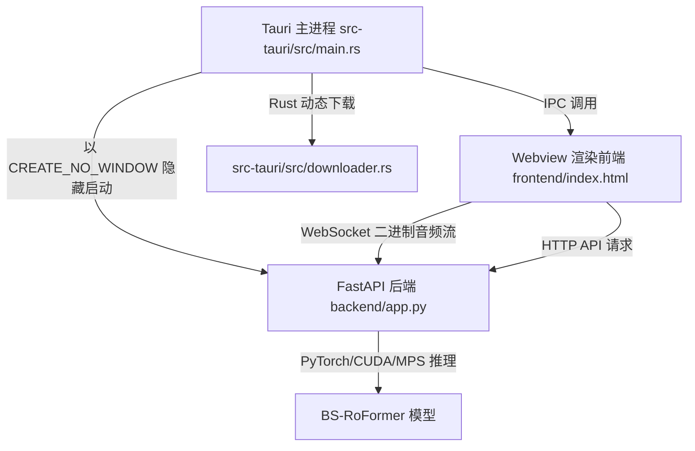

# VocalMap 🎙️

> 专业级声乐多维诊断与伴奏/乐器分离系统 (Professional Vocal Diagnosis & Stem Separation System)

VocalMap 是一款面向专业声乐教学、声音诊断与音频后期制作的现代桌面应用。它将**实时声学诊断可视化**与基于 **BS-RoFormer 模型**的专业级高精度音轨/乐器分离完美融合，为歌手、声乐教师及音乐制作人提供一站式的声学分析方案。

本项目采用 **Tauri (Rust) + FastAPI (Python)** 的极客暗黑风混合架构，底层声学算法注入了 Numba JIT 加速与智能颤音（Vibrato）解析。

---

## 📑 目录

- [✨ 核心特性与技术实现 (Features & Tech)](#-核心特性与技术实现-features--tech)
- [🏗️ 系统架构图 (Architecture)](#️-系统架构图-architecture)
- [📁 代码库核心导航 (Codebase Guide)](#-代码库核心导航-codebase-guide)
- [⚙️ 安装与运行 (Installation & Usage)](#️-安装与运行-installation--usage)
- [🛠️ 开发与构建 (Development)](#️-开发与构建-development)
- [📦 最近更新 (Recent Updates)](#-最近更新-recent-updates)
- [📄 许可与声明 (License)](#-许可与声明-license)

---

## ✨ 核心特性与技术实现 (Features & Tech)

### 🎧 全方位声学诊断与回放 (`frontend/js/playback.js`, `frontend/js/realtime_monitor.js`)
* **实时演唱录制与回放**：基于 Web Audio API 捕获 PCM 音频流，与音高数据强绑定，打包保存为专属 `.vmap` 项目文件。回放时 `realtime_monitor.js` 会通过 Canvas 绘制贝塞尔曲线并自动锁定中心音高。
* **Pro 模式离线高速分析**：由 `backend/services/reporter.py` 驱动，绕过浏览器播放限制，在极短时间内对本地音频文件进行全量深度诊断。
* **一键导出高清长图报告**：利用 `frontend/js/dom-to-image.min.js`，无缝绕开 Tauri 沙盒限制，一键将诊断 DOM 节点转换为无损长截图。

### 🚀 靶向发声训练营 (Vocal Training Camp, `frontend/js/training.js`)
* **6 大渐进式关卡**：引擎动态生成关卡（绝对音准、喉位敏捷、强悍胸声、穿透头声、靶向混声魔鬼摩擦、全音域制霸大琶音）。
* **动态预判运镜 (Look-ahead Camera)**：在 `training.js` 中重构的相机追踪算法，智能平滑跟随即将出现的靶向方块，解决大跨度高音（如 Level 6）目标飞出屏幕的痛点。

### 🎸 专业级 AI 音轨分离 (Stem Separation, `logic_bsroformer/inference.py`)
* **多模型支持**：内置 **6-stem 全能乐器分离模型 (`logic_roformer_6s`)** 和 **BS-RoFormer Karaoke 伴奏分离模型 (`bs_roformer_karaoke`)**。由 `backend/separation.py` 调度。
* **抗锯齿与重采样优化**：在 `inference.py` 中采用 `librosa.load(..., res_type='soxr_qq')`，实现极速高质量的 CPU 音频加载。
* **智能残差剥离防覆盖**：专门针对预测 Instrumental 伴奏的模型，优化了 `inference.py` 的减法剥离逻辑，防止导出纯人声时在 Windows 上被大小写不敏感的文件系统覆写。

### 🎛️ 底层声学引擎优化 (`backend/acoustic_engine/analyzer.py`)
* **Numba JIT 底层提速**：在 `analyzer.py` 中，使用 `@jit(nopython=True)` 将最吃 CPU 的 YIN 差分算法循环转化为 C 级别机器码，保证零卡顿。
* **智能泛音/颤音解析**：结合 CMNDF 强置信度校验屏蔽假高频泛音；通过长达 2 秒的历史音高缓存测算 Zero-crossing Rate，精准识别演唱颤音并转化为 `vibrato` 评分。

---

## 🏗️ 系统架构图 (Architecture)

VocalMap 采用**安全高性能的前后台分离+本地双进程通信**的桌面端混合架构：



---

## 📁 代码库核心导航 (Codebase Guide)

为了方便后续维护与协作，以下是本项目最核心的代码结构与对应职能清单：

| 目录/文件 | 核心架构与职能说明 |
| --- | --- |
| `src-tauri/src/main.rs` | 整个程序的 Rust 外壳入口，负责生成硬件设备码、创建主窗体，以及隐形挂载/关闭本地的 Python FastAPI 进程树。 |
| `src-tauri/src/downloader.rs` | Rust 动态下载管理器，解决 AI 模型（数 GB）打包进安装包会超限和拖慢解压的问题。在应用运行时自动拉取依赖库与模型检查点。 |
| `backend/app.py` | Python 后端 FastAPI 入口引擎，负责初始化生命周期、处理前端 HTTP 轮询请求、WebSocket 实时音频/日志双向通信。 |
| `backend/separation.py` | AI 音轨分离的中间件与进度监控中心。负责组装执行命令、读取 `subprocess` 管道日志并映射给前端的 UI 进度条。 |
| `backend/acoustic_engine/analyzer.py` | 最硬核的声学算法大脑，底层使用了 `@jit(nopython=True)` 引擎加速，负责实时 YIN 音高检测、基频提纯、共振峰映射与信号降噪滤波。 |
| `backend/services/reporter.py` | 离线专业诊断服务模块，统筹 `analyzer.py` 以及各种统计器，生成最终的五维雷达图诊断数据并传输给前端。 |
| `logic_bsroformer/inference.py` | BS-RoFormer 神经网络的推理核心执行脚本，负责载入 PyTorch 模型检查点、大文件分块 (Chunking)、重叠相加 (OLA)、 Test-Time Augmentation (TTA) 以及声轨导出和残差剥离计算。 |
| `frontend/js/separation.js` | 负责音轨分离功能的前端面板逻辑，包括轮询后端处理状态、渲染分离进度动画及根据不同模型正确映射下载轨道。 |
| `frontend/js/audio_engine.js` | Web Audio API 核心封装层，实现麦克风物理硬件录音、PCM 波形捕获、加入 DynamicsCompressorNode 动态压限器处理并推流给后端的 WebSocket 通道。 |
| `frontend/js/realtime_monitor.js` | 负责演唱界面的重型 UI 渲染，基于 HTML5 Canvas 实现波形实时渲染与滚动引擎，绘制丝滑的音高反馈曲线与多维动态计分盘。 |

---

## ⚙️ 安装与运行 (Installation & Usage)

### 环境要求
* **Node.js** (推荐 LTS 版本)
* **Rust** 编译环境
* **Windows OS** (因使用了便携版 Windows Python 环境)

### 快速启动
1. **安装 Node.js 依赖**：
   ```bash
   npm install
   ```
2. **配置 Python 开发环境**：
   ```bash
   .\scripts\setup_portable_python.ps1
   ```
   *(该脚本会自动初始化包含 `numba`、`librosa` 的独立轻量级 Python 环境)*
3. **启动开发环境**：
   ```bash
   npm run dev
   ```
   *(Tauri 将自动在后台拉起 FastAPI 后端)*

---

## 🛠️ 开发与构建 (Development)

运行自动化编译脚本打包生产版本：

```bash
.\scripts\build_tauri.ps1
```
* **自动签名与隐形化**：脚本强制将 Python 进程配置 `CREATE_NO_WINDOW` 杜绝命令行闪框。
* **动态环境装载**：重型 PyTorch 依赖不打入 NSIS 单文件包，在运行时通过 Rust 动态装载并覆盖 `PYTHONPATH`，防止 NSIS 假死瘫痪。

---

## 📦 最近更新 (Recent Updates)

* **[国际化]** **帮助手册全面本地化**：重构了 `frontend/src/components/modal_help.html` 中的 HTML 文本，用特定 ID 的 `<span>`/`<p>` 标签隔离文字与 SVG 图标，并在 `frontend/js/lang.js` 中新增完整的英文与中文手册映射，实现 100% 国际化翻译支持。
* **[国际化]** **系统语言自动探测与缓存**：首次加载应用时，系统会根据 OS 系统语言（如 `navigator.language`）自动初始化语言（中文则显示中文，否则为英文），并在 `localStorage` 进行持久化缓存；将语言选择菜单挪至“引擎调节”参数面板最顶端。
* **[更新系统]** **重构更新提示 UI & Toast 弹窗**：移除了顶部导航栏硬编码的更新状态文本。所有的检查更新状态、下载百分比进度、更新失败及重启引导均通过 `showToast()` 气泡提醒，并且重写了更新说明窗口布局与滚动条样式以杜绝溢出。
* **[修复]** **声乐诊断计时器挂死修复**：重构了 `frontend/js/pro_diagnosis.js`，改为在计时器循环中动态获取 `#recordTimer` 节点，彻底修复了因中英文语言切换重写 DOM 导致计时器 DOM 引用丢失、使麦克风实时监测时间锁定在 0s 的 Bug。
* **[修复]** **分析流程挂死与报错提示**：在 `backend/app.py` 中对一键离线诊断及录音诊断进行了更全面的 `try-except` 捕获。在有效发声数据不足（或抛出其他后台异常）时，不再会让前端无限卡死在“正在分析”状态，而是主动向前端返回错误 status 并使用 Toast 抛出“数据不足，请维持足够时长”等多语言警告。
* **[优化]** **授权检测逻辑优化**：优化了 Pro 模式的授权激活界面跳转与验证逻辑，避免已购买 Pro 版本的用户在合理使用功能时反复弹出激活 CDK 的覆盖提示。
* **[优化]** `logic_bsroformer/inference.py` 残差逻辑重构：智能判断 `target_instrument`。针对预测伴奏的 Karaoke 模型，将残差重定向命名为 `Vocals`，彻底修复了分离伴奏时由于 Windows 文件大小写不敏感导致的相互覆盖（伴奏变人声）严重 Bug。
* **[修复]** 修正了 `logic_bsroformer/configs/config_karaoke_frazer_becruily.yaml` 中的目标对象，将其硬编码指回 `Instrumental`。
* **[UI]** 调整了 `frontend/js/separation.js` 中的轨道映射字典，正确适配了 Karaoke 模型的下载对应关系，并为 `logic_roformer_6s` 模型配置了全新的 `纯伴奏` 专属中文标签与图标。
* **[提速]** 改进 `inference.py` 中的 `librosa.load` 调用，引入 `soxr_qq` 重采样算法，大幅降低 CPU 占用并提升大文件载入速度。

---

## 📄 许可与声明 (License)

VocalMap 核心分离算法基于 [BS-RoFormer](https://github.com/ZFTurbo/Music-Source-Separation-Training) 等开源成果二次开发。

本项目采用软件源码可用、但限制商业用途的许可证授权。关于本项目的商业授权、源码复用及非商业化使用界限，请参见根目录下的 LICENSE 文件。