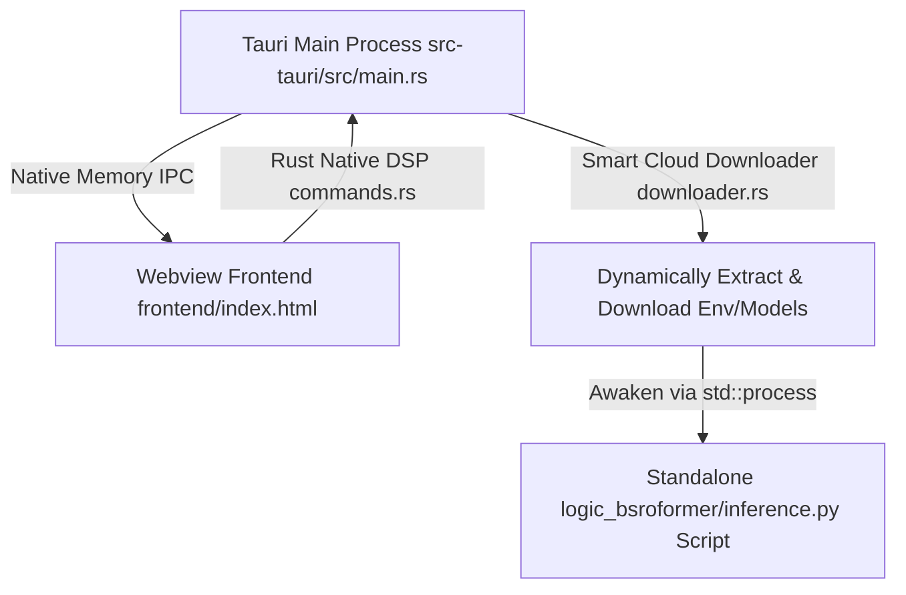

# VocalMap 🎙️

English Version | [简体中文](../README.md)

> Professional Vocal Diagnosis & Stem Separation System


VocalMap is a modern desktop application designed for professional vocal teaching, voice diagnosis, and audio post-production. It perfectly integrates **real-time acoustic diagnostic visualization** with professional-grade high-precision stem/instrument separation based on the **BS-RoFormer model**, providing a one-stop acoustic analysis solution for singers, vocal coaches, and music producers.

This project has completed a grand leap from a hybrid architecture to a **Full-Domain Pure Rust IPC Driven** ecosystem, utilizing a geeky dark-mode architecture of **Tauri v2 + Native Rust DSP Engine**.

---

## 📑 Table of Contents

- [✨ Features & Tech](#-features--tech)
- [🏗️ Architecture](#️-architecture)
- [📁 Codebase Guide](#-codebase-guide)
- [⚙️ Installation & Usage](#️-installation--usage)
- [🛠️ Development](#️-development)

---

## ✨ Features & Tech

### 🎧 Omnidirectional Acoustic Diagnosis & Playback (`frontend/js/playback.js`, `frontend/js/realtime_monitor.js`)
* **Real-time Singing Recording & Playback**: Captures PCM audio streams based on the Web Audio API, tightly binding it with pitch data emitted from the underlying Rust DSP, and saving it as an exclusive `.vmap` project file. During playback, `realtime_monitor.js` draws Bezier curves via Canvas and automatically locks onto the center pitch.
* **Native Rust DSP Engine**: Bypasses browser playback restrictions, utilizing lightning-fast Rust algorithms to conduct full-scale deep diagnosis on audio files.

### 🚀 Target Vocal Training Camp (`frontend/js/training.js`)
* **6 Progressive Levels & Custom Target Training**: The engine not only dynamically generates 6 basic levels but also supports importing discrete block-like pitch sequences mapped into custom target blocks, perfectly syncing with underlying WebM/WAV accompaniments.
* **Look-ahead Camera**: The rebuilt camera tracking algorithm in `training.js` intelligently and smoothly follows upcoming target blocks, solving the pain point of targets flying off-screen during large pitch jumps (e.g., Level 6).

### 🎸 Professional AI Stem Separation (`logic_bsroformer/inference.py`)
* **Completely Independent Subprocess Mounting**: No longer tightly binds the heavy Python engine with the local backbone. Instead, it dynamically downloads a pure runtime library (`python_runtime`) from the cloud, and Rust then unshells and awakens the standalone `inference.py` script via `std::process::Command`, achieving complete decoupling.
* **Dual-Modal Data Extraction Engine**: Added dual-format export for `.vmap` (for continuous pitch review) and `.tmap` (discrete scale blocks), creating a data loop from stem separation to target training.

### 🔒 Native Machine Code Security Shield
The original Python FastAPI was highly vulnerable to decompilation and reverse engineering. It has now been entirely ported to native Rust machine code:
* **Anti-Clock Rollback Defense**: The `.sys_state` timestamp fingerprint is stored natively encrypted, preventing illegal clock tampering.
* **Hardcore Authorization Encryption**: RSA private key obfuscation and public key verification are all built into the compiled Rust artifacts.

---

## 🏗️ Architecture

VocalMap now utilizes an **All-Native Ultra-Fast Dual-End IPC Communication Architecture**:



---

## 📁 Codebase Guide

For easier maintenance and collaboration, below is the core code structure and corresponding responsibilities:

| Directory/File | Core Architecture & Responsibility |
| --- | --- |
| `src-tauri/src/main.rs` | The Rust shell entry point, responsible for generating hardware device codes and registering various IPC routes. |
| `src-tauri/src/commands.rs` | The hardcore acoustic algorithm brain, natively accelerated by Rust, including YIN pitch detection, CMNDF calculations, and auth encryption interception. |
| `src-tauri/src/downloader.rs` | The Rust dynamic download manager and extraction pipeline. Completely solves the limit-exceeding problem of packaging AI models (GBs) into the installer, and intelligently skips existing local packages. |
| `logic_bsroformer/inference.py` | The BS-RoFormer neural network inference execution script, awakened solely as an independent subprocess by Tauri. |
| `frontend/js/separation.js` | Frontend panel logic for stem separation, handling underlying Rust event polling and progress animation rendering. |
| `frontend/js/audio_engine.js` | Web Audio API core wrapper, capturing physical mic recording and PCM waveforms, processed via DynamicsCompressorNode. |

---

## ⚙️ Installation & Usage

### Environment Requirements
* **Node.js** (LTS recommended)
* **Rust** Build Environment

### Quick Start
1. **Install Frontend Dependencies**:
   ```bash
   npm install
   ```
2. **Start Tauri Dev Environment**:
   ```bash
   npm run dev
   ```

---

## 🛠️ Development

Run the automated compilation script to package the production release (10MB level):

```bash
.\scripts\build_tauri.ps1
```
* **One-Click Compilation**: Automatically configures the Tauri Updater signature environment and calls `npx tauri build` to output a lightweight installer directly.
