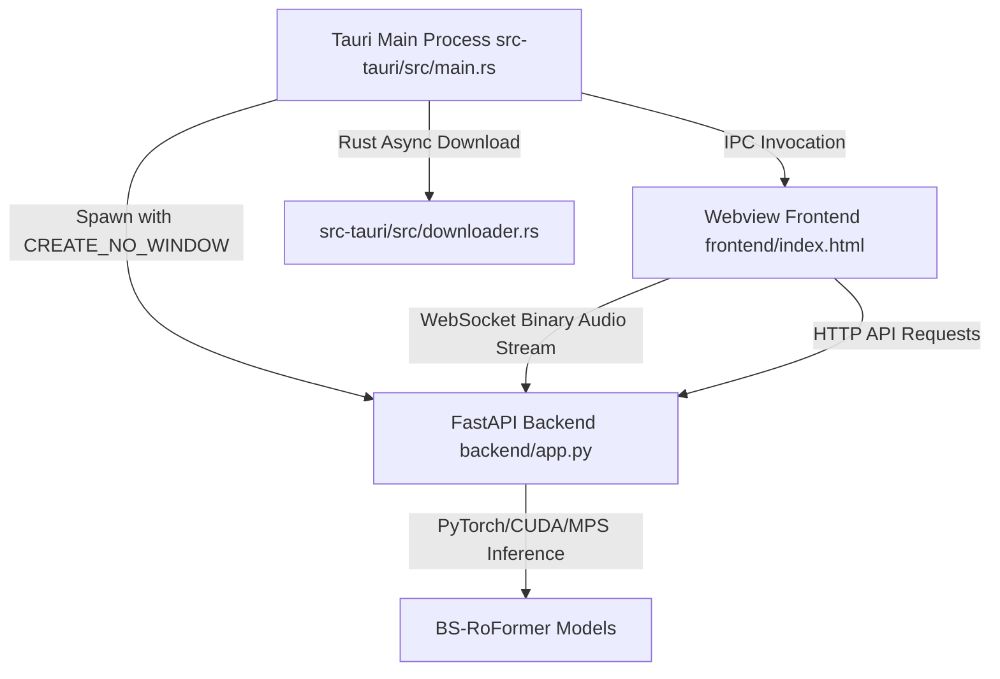

# VocalMap 🎙️

English | [简体中文版](README_CORE.md)

> Professional Vocal Diagnosis & Stem Separation System

VocalMap is a desktop application designed for professional vocal pedagogy, voice analysis, and audio post-production. It combines **real-time acoustic visualization** with professional **BS-RoFormer-based** stem/instrument separation to provide a comprehensive acoustic analysis suite.

The application employs a hybrid **Tauri (Rust) + FastAPI (Python)** architecture, with Numba JIT compiling core acoustic algorithms and automatic vibrato detection.

---

## 📑 Table of Contents

- [✨ Features & Tech](#-features--tech)
- [🏗️ Architecture](#️-architecture)
- [📁 Codebase Guide](#-codebase-guide)
- [⚙️ Installation & Usage](#️-installation-and-usage)
- [🛠️ Development](#️-development)
- [📦 Recent Updates](#-recent-updates)
- [📄 License](#-license)

---

## ✨ Features & Tech

### 🎧 Acoustic Diagnosis & Playback (`frontend/js/playback.js`, `frontend/js/realtime_monitor.js`)
* **Real-time Recording & Playback**: Captures PCM streams via Web Audio API, binds it to pitch tracks, and packs them into `.vmap` project files. During playback, `realtime_monitor.js` renders a Bezier curve on HTML5 Canvas and locks the viewport center to the vocal pitch.
* **Pro Offline Analysis**: Powered by `backend/services/reporter.py`, this processes local audio files instantly to output comprehensive 6-dimensional reports without real-time playback.
* **HD Long Image Export**: Employs `frontend/js/dom-to-image.min.js` to bypass Tauri sandbox limits, rendering high-resolution无损 screenshots of diagnostic reports.

### 🚀 Targeted Vocal Training Camp (`frontend/js/training.js`)
* **6 Progressive Levels**: Dynamically generates vocal training targets (Pitch Accuracy, Laryngeal Agility, Chest Power, Head Penetration, Mixed Voice Control, and Full Range Arpeggio).
* **Look-ahead Camera**: A custom tracking algorithm in `training.js` smooths the camera viewport transition ahead of upcoming target boxes, solving the issue of targets jumping out of view.

### 🎸 AI Stem Separation (`logic_bsroformer/inference.py`)
* **Multi-Model Support**: Integrates the **6-stem instrument separation model (`logic_roformer_6s`)** and **BS-RoFormer Karaoke model (`bs_roformer_karaoke`)** coordinated by `backend/separation.py`.
* **Resampling Optimization**: Leverages `librosa.load(..., res_type='soxr_qq')` in `inference.py` for ultra-fast, high-quality CPU audio loading.
* **Residual Extraction & File Safety**: Features an optimized subtraction logic in `inference.py` that separates vocals cleanly and avoids case-insensitive filename overwriting on Windows systems.

### 🎛️ Acoustic Engine & JIT (`backend/acoustic_engine/analyzer.py`)
* **Numba JIT Acceleration**: Uses `@jit(nopython=True)` to compile the CPU-bound YIN difference loops into C-level machine code, eliminating audio latency and UI stutters.
* **Harmonic & Vibrato Analysis**: CMNDF confidence validation filters out octave errors; calculates zero-crossing rates over a 2-second pitch buffer to score vocal vibratos.

### 🔒 Security & Privacy Protection (Local Security Gateway)
To protect user privacy (microphone data and local audio assets) and shield local GPU/CPU hardware resources from unauthorized third-party apps:
* **Dynamic Port Allocation**:
  - Implementation: [lib.rs](file:///c:/Users/10431/Desktop/vocal%20map/src-tauri/src/lib.rs) (`get_available_port`)
  - Tech Details: Binds to port `0` on startup to let the OS assign a random idle port. This passes it as a command line arg to FastAPI, preventing port collisions and blocking local sniffing/hijacking of the WebSocket audio stream.
* **Internal API Token Validation**:
  - Implementation: [lib.rs](file:///c:/Users/10431/Desktop/vocal%20map/src-tauri/src/lib.rs) (`generate_token`), [app.py](file:///c:/Users/10431/Desktop/vocal%20map/backend/app.py) (`check_api_token`)
  - Tech Details: Tauri generates a 32-character random string, passing it as `VOCALMAP_INTERNAL_TOKEN`. FastAPI middleware checks the `X-VocalMap-Token` header on all API/WS calls. Unauthorized processes are rejected (401 Unauthorized), protecting GPU/CPU/power resources from hijacking.
* **Anti-Clock Tampering & Obfuscation**:
  - Implementation: [analyzer.py](file:///c:/Users/10431/Desktop/vocal%20map/backend/acoustic_engine/analyzer.py) (`check_clock_tampering`, `get_public_key`)
  - Tech Details: Writes time state into `.sys_state` using XOR obfuscation. If system time rolls back, a `LicenseError` blocks execution, protecting runtime consistency. Public keys are also XOR-encoded to prevent static analysis replacement.

---

## 🏗️ Architecture

VocalMap adopts a secure, high-performance desktop architecture decoupling front and back ends:



---

## 📁 Codebase Guide

| File / Folder | Architecture & Responsibility |
| --- | --- |
| `src-tauri/src/main.rs` | Main Rust entry point. Fetches hardware machine IDs, creates the UI window, and spawns/kills the FastAPI child process tree. |
| `src-tauri/src/downloader.rs` | Manages runtime downloading of massive AI model checkpoints to keep the installer lightweight. |
| `backend/app.py` | FastAPI app gateway. Initializes app lifecycles, and routes HTTP/WebSocket endpoints for audio analysis. |
| `backend/separation.py` | AI Separation middleware. Coordinates background subprocess jobs and maps console progress percentages to the frontend. |
| `backend/acoustic_engine/analyzer.py` | Core acoustic engine brain. Compiles YIN pitch tracking, filters noise, and computes harmonics. |
| `backend/services/reporter.py` | Computes comprehensive voice reports and aggregates five-dimensional metrics. |
| `logic_bsroformer/inference.py` | Deep learning execution core. Loads PyTorch weights, chunking audio, OLA overlapping, and performing TTA. |
| `frontend/js/separation.js` | UI logic for separation panels. Manages model selection and polls task states. |
| `frontend/js/audio_engine.js` | Audio capturing module. Wraps Web Audio API, adds DynamicsCompressorNode, and pushes binary PCM to WebSocket. |
| `frontend/js/realtime_monitor.js` | Heavy canvas rendering. Plots real-time Bezier audio paths and manages performance dashboards. |

---

## ⚙️ Installation & Usage

### Requirements
* **Node.js** (LTS recommended)
* **Rust compiler**
* **Windows OS** (due to embedded portable Python bundle)

### Quick Start
1. **Install Node.js dependencies**:
   ```bash
   npm install
   ```
2. **Setup Portable Python environment**:
   ```powershell
   .\scripts\setup_portable_python.ps1
   ```
   *(Initializes a self-contained Python runtime with numba, librosa, and PyTorch)*
3. **Run Dev server**:
   ```bash
   npm run dev
   ```
   *(Tauri will automatically boot up the FastAPI backend on a secure random port)*

---

## 🛠️ Development

Run the automation build script to bundle the production release:

```powershell
.\scripts\build_tauri.ps1
```
* **No-Window Mode**: Configures Python backend to spawn with `CREATE_NO_WINDOW` flags on Windows to prevent console flashing.
* **Dynamic Dependency Linking**: Prevents heavy PyTorch libraries from crashing the NSIS installer compiler by resolving dependency layouts at runtime.

---

## 📦 Recent Updates

* **[Security]** **Local Communication Gateway**: Re-engineered backend networking. Replaced fixed port `5050` with dynamic OS binding, introduced local token handshakes (`VOCALMAP_INTERNAL_TOKEN`), and added time rollback verification to protect user voice privacy and GPU/CPU power resources.
* **[I18n]** **Bilingual Help Manual**: Restructured elements in `modal_help.html` and added translation records in `frontend/js/lang.js` for full English/Chinese manuals.
* **[I18n]** **System Language Detection**: Detects client OS language on first launch and caches preferences in `localStorage`.
* **[OTA Update]** **Toast-style Alerts**: Replaced hardcoded update labels with dynamic `showToast()` alerts for update check, download percentage, and restart guides.
* **[Fix]** **Vocal Timer Bug**: Fixed reference loss on `#recordTimer` when toggling languages.
* **[Fix]** **Analysis Crash Recovery**: Added robust try-except loops to offline reporters to return structured multi-lingual alerts when voice length is insufficient.

---

## 📄 License

VocalMap uses core algorithms based on open-source projects like [BS-RoFormer](https://github.com/ZFTurbo/Music-Source-Separation-Training).
Source code is available but commercial reuse and sub-licensing are restricted. See [LICENSE.md](LICENSE.md) for details.
